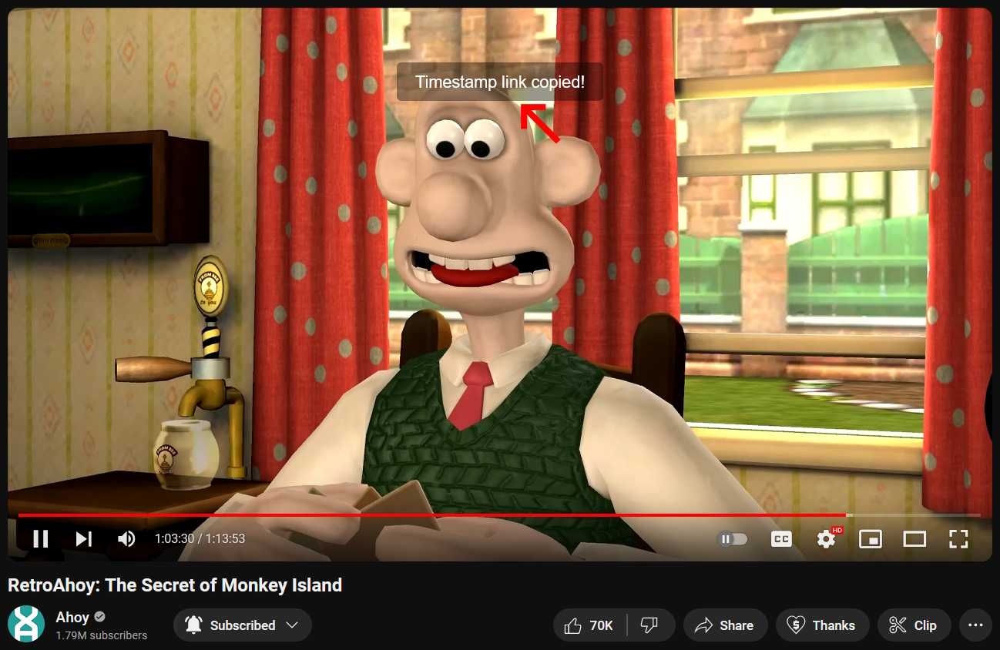

# YouTube - Copy Timestamp Link Shortcut

CTLS is a simple userscript that allows the use of a keyboard shortcut to copy a direct link to the current time in a YouTube video.

## Features

- **Copy to Clipboard :** The copied URL will be placed right in your clipboard, just paste it anywhere you want.

- **Simple Notification:** Copying a timestamped link will trigger a popup to let you know you've been successful.

## Installation

1. Install a userscript manager (like [Violentmonkey](https://violentmonkey.github.io/get-it/)).
2. [Click here to install](https://github.com/WesternFreak/YouTube-Copy-Timestamp-Link-Shortcut/raw/main/yt-ctls.user.js) the script.

## How to Use

- Copy timestamped URL: `Ctrl` + `Left Alt` + `T` 
